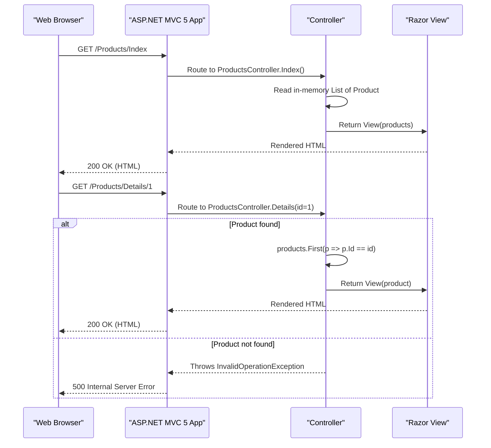

# API & Service Communication Contracts

This is a single-service ASP.NET MVC 5 web application exposing 4 HTML-rendering controller action endpoints with no REST API, no asynchronous messaging, and no inter-service communication.

## Service Catalog

| Service | Port | Category | Purpose |
|---|---|---|---|
| CleanArchitectureAspNetMvc5 | 3326 (IIS Express) | Business | Monolithic ASP.NET MVC 5 web application serving HTML pages for Home, Products, and Contact features |

## API Endpoints Inventory

| Service | Method | Path | Request Type | Response Type |
|---|---|---|---|---|
| HomeController | GET | `/` or `/Home/Index` | None | HTML View (Index) |
| ProductsController | GET | `/Products/Index` | None | HTML View (product list) |
| ProductsController | GET | `/Products/Details/{id}` | Path param: `id` (int) | HTML View (product detail) |
| ContactController | GET | `/Contact/Index` | None | HTML View (Index) |

> Note: All endpoints return HTML views rendered server-side by Razor. There are no JSON REST endpoints or API controllers.

## Management & Observability Endpoints

| Service | Endpoint | Custom Metrics |
|---|---|---|
| CleanArchitectureAspNetMvc5 | None configured | None |

No health check, Swagger, or metrics endpoints are configured. The application has no observability infrastructure.

## DTOs & Contracts

One domain model class is used as a view model:

- **`Product`** (namespace: `CleanArchitectureAspNetMvc5.Products.Models`) — Passed directly from `ProductsController` to the Products Index and Details Razor views. Acts as both the domain entity and the view model. Contains `Id`, `Name`, and `Price` fields. It is a mutable POCO class with no serialization attributes. See `data-architecture.md` for field-level details.

There are no request body DTOs, JSON serialization contracts, OpenAPI/Swagger specifications, protobuf schemas, or GraphQL schemas in this project.

## Communication Patterns

**Synchronous**: All communication is request/response HTTP between the browser and the single MVC application. Controllers return `ActionResult` (HTML views) directly with no calls to external services, downstream APIs, or databases.

**Asynchronous**: None. There are no message queues, event buses, or background workers.

**Resilience**: No circuit breaker, retry, timeout, or bulkhead patterns are implemented. The application has no external dependencies to protect against.

**Service Discovery**: Not applicable. The application is a single deployable unit.

**API Gateway**: None.

**Security Posture**: No authentication, authorization, or TLS is configured in code. All four controller action endpoints are publicly accessible with no authorization checks. ASP.NET MVC 5's default anti-forgery token infrastructure is available but not applied to any action. No `[Authorize]` attributes, no identity middleware, and no HTTPS enforcement are present.

## Service Technology Matrix

| Service | Web Framework | Data Access | Discovery | Gateway | Health Checks | Cache | Metrics |
|---|---|---|---|---|---|---|---|
| CleanArchitectureAspNetMvc5 | ASP.NET MVC 5.2.2 (Razor) | None (in-memory list) | None | None | None | None | None |

## Service Communication Sequence

