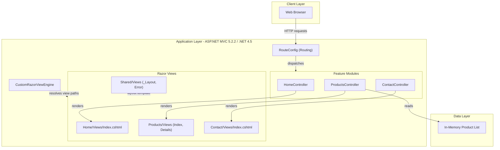
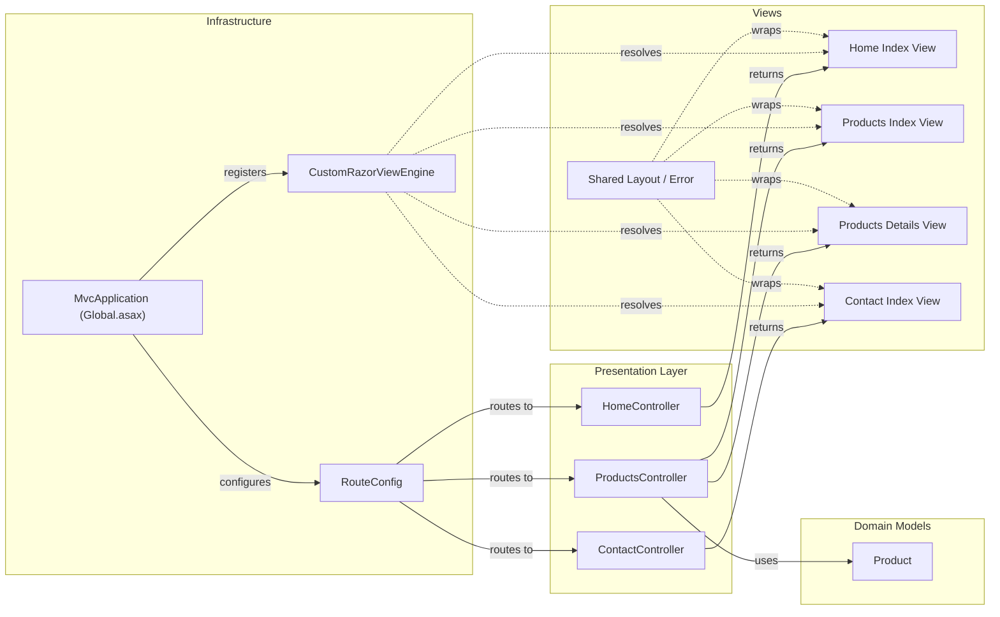

# Architecture Diagram

This document describes the architecture and component relationships of the CleanArchitectureAspNetMvc5 application, a classic ASP.NET MVC 5 web application built on .NET Framework 4.5 organized around feature-based vertical slices.

## Application Architecture

### Technology Stack Summary

| Layer | Technology | Version | Purpose |
|---|---|---|---|
| Presentation | ASP.NET MVC | 5.2.2 | Server-side MVC web framework |
| Presentation | Razor View Engine | 3.2.2 | Server-side HTML templating |
| Presentation | Bootstrap CSS | - | UI styling |
| Runtime | .NET Framework | 4.5 | Application runtime platform |
| Web Host | IIS / IIS Express | - | HTTP server and application host |

### Data Storage & External Services

This application uses no persistent external data storage or external service integrations. Product data is held entirely in an in-memory `List<Product>` within `ProductsController`. There are no database connections, caches, message brokers, or third-party API integrations.

### Key Architectural Decisions

- **Feature-based vertical slice structure**: Controllers, Views, and Models for each feature (Home, Products, Contact) are co-located in feature folders rather than following the conventional MVC `Controllers/`, `Views/`, `Models/` flat layout.
- **Custom Razor View Engine**: `CustomRazorViewEngine` overrides default view location formats to resolve views from `~/{controller}/Views/{view}.cshtml`, supporting the feature-folder convention.
- **In-memory data only**: No repository pattern or data-access layer is present; `ProductsController` directly instantiates a hardcoded list, keeping the project simple and framework-agnostic at the data layer.

## Component Relationships

### Component Inventory

| Component | Layer | Type | Responsibility |
|---|---|---|---|
| HomeController | Presentation | MVC Controller | Serves the home/landing page |
| ProductsController | Presentation | MVC Controller | Lists products and shows product details using in-memory data |
| ContactController | Presentation | MVC Controller | Serves the contact page |
| Product | Domain Models | Model/Entity | Represents a product with Id, Name, and Price properties |
| CustomRazorViewEngine | Infrastructure | View Engine | Overrides Razor view location to support feature-folder layout |
| RouteConfig | Infrastructure | Route Configuration | Registers MVC URL routing rules (default `{controller}/{action}/{id}`) |
| MvcApplication | Infrastructure | Application Bootstrap | Registers view engine, areas, and routes at application startup |
| Home/Views/Index.cshtml | Views | Razor View | Home page UI |
| Products/Views/Index.cshtml | Views | Razor View | Product listing UI |
| Products/Views/Details.cshtml | Views | Razor View | Product detail UI |
| Contact/Views/Index.cshtml | Views | Razor View | Contact page UI |
| Shared/Views/_Layout.cshtml | Views | Razor Layout | Shared master layout template |
| Shared/Views/Error.cshtml | Views | Razor View | Error page UI |
