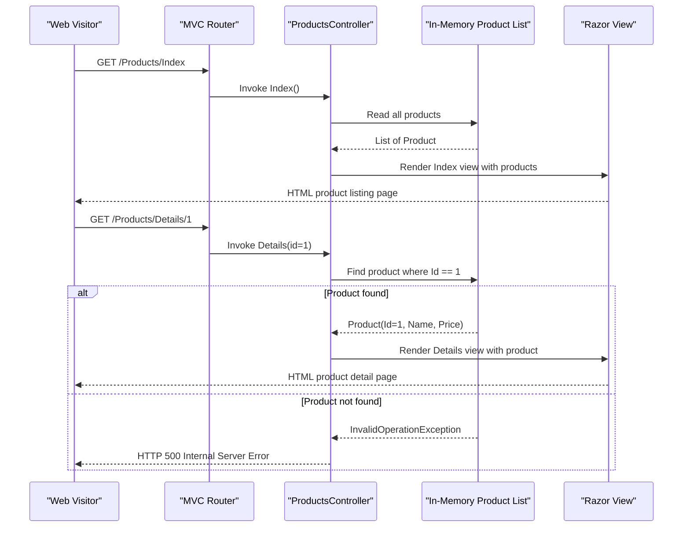

# Core Business Workflows

This application is a simple product catalog web application that allows visitors to browse a list of products and view individual product details, alongside static Home and Contact pages.

## Domain Entities

| Entity | Service / Bounded Context | Description | Key Relationships |
|---|---|---|---|
| Product | Product Catalog | Represents a sellable item with a name and price | Standalone entity; no relationships to other entities |

## Service-to-Domain Mapping

| Service | Domain Context | Owned Entities | External Dependencies |
|---|---|---|---|
| CleanArchitectureAspNetMvc5 | Product Catalog | Product | None |

This is a single-service monolithic application with one bounded context. There are no inter-service communication patterns, API gateways, or external domain dependencies.

## Primary Workflows

### Workflow 1: Browse Product List

A visitor navigates to the products listing page to see all available products.

**Steps:**
1. Visitor requests `/Products/Index`.
2. `ProductsController` is invoked by the MVC routing framework.
3. The controller reads the hardcoded in-memory `List<Product>`.
4. The controller passes the full product list to the `Products/Views/Index` Razor view.
5. The view renders an HTML page listing all products with their names and prices.
6. The rendered HTML is returned to the browser.

**Business rules involved:** None beyond routing. No filtering, sorting, or access control is applied.

---

### Workflow 2: View Product Details

A visitor clicks on a product to see its detailed information.

**Steps:**
1. Visitor requests `/Products/Details/{id}`.
2. `ProductsController.Details(int id)` is invoked with the `id` path parameter.
3. The controller calls `_products.First(p => p.Id == id)` against the in-memory list.
4. If a product with the given `id` exists, it is passed to the `Products/Views/Details` Razor view.
5. The view renders an HTML page with the product's full details.
6. The rendered HTML is returned to the browser.

**Business rules involved:**
- Product lookup by `Id` — an exact match is required.
- If no product matches the `id`, `Enumerable.First()` throws `InvalidOperationException`, which results in an unhandled HTTP 500 error. No explicit not-found handling is implemented.

---

### Workflow 3: View Home Page

A visitor navigates to the application root or `/Home/Index`. `HomeController.Index()` returns the static home view with no data or business logic.

---

### Workflow 4: View Contact Page

A visitor navigates to `/Contact/Index`. `ContactController.Index()` returns the static contact view with no data or business logic.

## Cross-Service Data Flows

This application is a single deployable service with no cross-service data flows. All data (the in-memory product list) originates and is consumed within `ProductsController`. There are no API gateway aggregation patterns, event-driven data flows, or inter-service dependencies.

## Business Workflow Sequence

## Business Rules & Decision Logic

**Validation Rules:**
- No explicit input validation is implemented. The `id` path parameter is bound by ASP.NET MVC's default model binding (must be a valid integer); non-integer values result in a 400 Bad Request from the framework.

**Decision Logic:**
- Product lookup: `_products.First(p => p.Id == id)` — exact match on `Id`. If no match exists, an unhandled exception propagates resulting in a 500 error. No business-level "not found" response (e.g., HTTP 404) is implemented.

**State Transitions:**
- None. The application is read-only; there are no create, update, or delete operations and no entity state machine.

**Business Constraints:**
- The product catalog is static and hardcoded. Only two products exist (`Id=1: Ice Cream, $1.23` and `Id=2: Cake, $2.34`). There is no persistence, so no data-integrity or uniqueness constraints apply at runtime.

**Cross-Cutting Concerns:**
- **Transactions**: None — no persistence layer.
- **Error handling**: No try/catch or custom error pages beyond ASP.NET MVC's default shared `Error.cshtml` view. Missing product IDs cause unhandled exceptions.
- **Audit/logging**: No logging framework or audit trail is present.
- **Authorization**: No authentication or authorization is applied to any workflow. All pages are publicly accessible.
