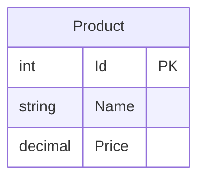

# Data Architecture & Persistence Layer

This application has a minimal data layer consisting of a single in-memory entity (`Product`) with no database, ORM framework, or persistence mechanism of any kind.

## Database Configuration

| Service/Module | DB Type | Profile | Driver | Connection | Migration Tool |
|---|---|---|---|---|---|
| CleanArchitectureAspNetMvc5 | None | All | None | None | None |

No database is configured. All data is stored in a hardcoded `List<Product>` instantiated within `ProductsController` at runtime. Data is non-persistent and reset on every application start.

## Data Ownership per Service

| Service | Tables Owned | ORM Framework | Caching | Notes |
|---|---|---|---|---|
| CleanArchitectureAspNetMvc5 | None (in-memory list) | None | None | Product data is a hardcoded in-memory list; no persistence layer exists |

## Entity Model

> Note: `Product` is an in-memory POCO class only. It is not mapped to any database table or ORM context.

## Key Repository Methods

No repository interfaces or data-access classes exist in this project. `ProductsController` directly instantiates and queries an in-memory `List<Product>`:

| Service | Repository | Notable Methods | Purpose |
|---|---|---|---|
| ProductsController | None (inline list) | `_products.First(p => p.Id == id)` | Find a product by Id from the in-memory list |

There is no repository pattern, unit-of-work, or any abstraction over data access.

## Caching Strategy

No caching layer is configured or used. Because all data is held in-memory within the controller instance for the lifetime of a single request, there is no need for an explicit cache. There are no cache providers (Redis, MemoryCache, EhCache, etc.), no TTL settings, and no cache-aside or read-through patterns.

## Data Ownership Boundaries

There is a single deployable service with no inter-service communication and no shared or distributed data store. All data is owned entirely by `ProductsController` and scoped to the lifetime of each HTTP request.

There are no CQRS patterns, event sourcing, or read/write separation. The application is purely request/response with synchronous, in-memory data access.

### Data Classification & Sensitivity

| Entity | Sensitive Fields | Classification | Controls in Place |
|---|---|---|---|
| Product | None | None | N/A |

No PII, PHI, or PCI data is detected in the entity model. The `Product` entity contains only `Id` (integer), `Name` (product name string), and `Price` (decimal) — none of which constitute sensitive personal or financial data.
