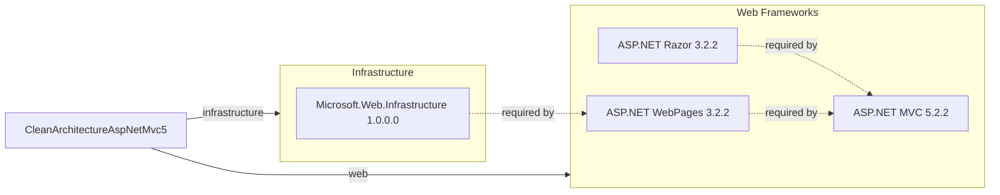

# Dependency Map

This document maps all external dependencies declared in the CleanArchitectureAspNetMvc5 project. The project declares **4 external NuGet packages** (plus .NET Framework 4.5 system assemblies).

## Dependencies

### Dependency Summary

| Category | Count | Key Libraries | Notes |
|---|---|---|---|
| Web Frameworks | 3 | ASP.NET MVC 5.2.2, ASP.NET Razor 3.2.2, ASP.NET WebPages 3.2.2 | Legacy MVC stack on .NET Framework 4.5; all three packages are end-of-life |
| Infrastructure | 1 | Microsoft.Web.Infrastructure 1.0.0.0 | Low-level bootstrapping helper for ASP.NET WebPages; no active development |

### Version & Compatibility Risks

All declared packages target .NET Framework 4.5, which reached end-of-support in January 2016. ASP.NET MVC 5 (System.Web-based) has been in maintenance-only mode since ASP.NET Core was released and does not receive new features. The `Microsoft.Web.Infrastructure` package is at version 1.0.0.0 with no updates since 2012. None of these packages are compatible with .NET Core or .NET 5+ without a full migration to ASP.NET Core. Migrating to .NET 10 and ASP.NET Core would require replacing the entire web framework stack.

### Notable Observations

- **Very lean dependency tree**: Only 4 NuGet packages are declared, all of which are tightly coupled parts of the ASP.NET MVC 5 stack. There are no third-party utility, logging, or data-access libraries.
- **No data-access packages**: The project has no ORM, database driver, or cache client — all data is stored in-memory. This simplifies migration but limits production readiness.
- **No logging or observability libraries**: There is no structured logging, tracing, or metrics library declared. Adding one would be a prerequisite for a production-grade cloud deployment.
- **No security packages**: There is no authentication, authorization, or anti-forgery library beyond what ASP.NET MVC 5 includes out of the box.

## Test Dependencies

No test dependencies detected. There are no test projects, test NuGet packages, or testing framework references in the solution.

Total test-scope dependencies: 0

No test infrastructure is present in this project. Adding a test framework (such as xUnit or MSTest with Moq) and at least basic controller unit tests would be recommended before any modernization effort.
